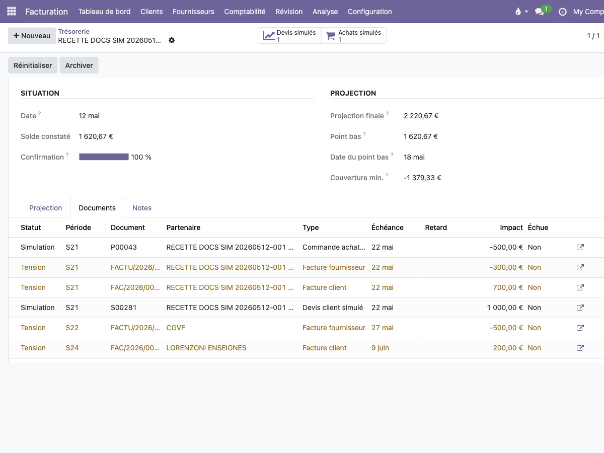

# PV de recette — Onglet Documents et intégration des simulations

**Date** : 12 mai 2026  
**Environnement** : `tenant_o8`  
**URL** : `http://localhost:18079`  
**Run** : `RECETTE DOCS SIM 20260512-001`  
**Projection Cash Guard** : id `1398`  
**Plan exécuté** : `docs/PLAN_RECETTE_ONGLET_DOCUMENTS.md`

---

## 1. Décision

**GO**

L'onglet `Facturation` est bien remplacé par `Documents`. L'onglet affiche une liste unifiée des documents expliquant la projection : factures réelles, devis clients simulés retenus et commandes achat simulées retenues.

---

## 2. Versions installées

| Module | Version |
| ------ | ------- |
| `dorevia_cash_guard` | `19.0.5.3.8` |
| `dorevia_cash_simulation` | `19.0.1.0.1` |
| `dorevia_cash_simulation_purchase` | `19.0.1.1.0` |

---

## 3. Tests automatisés

Suite relancée sur `tenant_o8` :

```text
dorevia_cash_guard : 65 tests
dorevia_cash_simulation : 24 tests
dorevia_cash_simulation_purchase : 18 tests
Total : 91 tests
Résultat : 0 failed, 0 error
```

Statut : **OK**

---

## 4. Recette fonctionnelle

| # | Test | Résultat |
| - | ---- | -------- |
| 1 | Renommage onglet : `Facturation` absent, `Documents` présent, onglets `Projection / Documents / Notes` | OK |
| 2 | Simulation OFF : l'onglet `Documents` affiche uniquement les factures réelles | OK |
| 3 | Simulation ON avec D1 + D2 : devis clients simulés visibles, impacts +1 000 € et +2 000 € | OK |
| 4 | Simulation ON avec D1 + P1 : devis client simulé + commande achat simulée visibles, impact achat -500 € | OK |
| 5 | Lignes simulées en statut `Simulation`, sans décoration de risque | OK |
| 6 | Devis hors période D3 exclu des documents retenus | OK |
| 7 | Liens d'ouverture : facture vers `account.move`, devis vers `sale.order`, achat vers `purchase.order` | OK |
| 8 | Réinitialiser : simulation désactivée, M2M vidés, documents simulés retirés | OK |
| 9 | Aucun effet comptable automatique lié aux simulations | OK |
| 10 | Cohérence des signes : D1 +1 000 €, D2 +2 000 €, P1 -500 €, P2 -1 500 €, total simulation +1 000 € | OK |

Contrôle complémentaire : une commande achat confirmée (`P2_CONFIRM`) est exclue de la projection simulée.  
Résultat : **OK**

---

## 5. Preuve visuelle

Capture de l'onglet `Documents` en mode simulation ON, avec facture réelle, devis client simulé et commande achat simulée visibles :



Constat visuel :

- lignes `Simulation` neutres ;
- factures réelles en couleur de statut `Tension` ;
- impacts cohérents : achat simulé `-500,00 €`, facture fournisseur `-300,00 €`, facture client `700,00 €`, devis client simulé `1 000,00 €`.

---

## 6. Conclusion

La recette du plan `PLAN_RECETTE_ONGLET_DOCUMENTS.md` est validée.

Décision : **GO**
