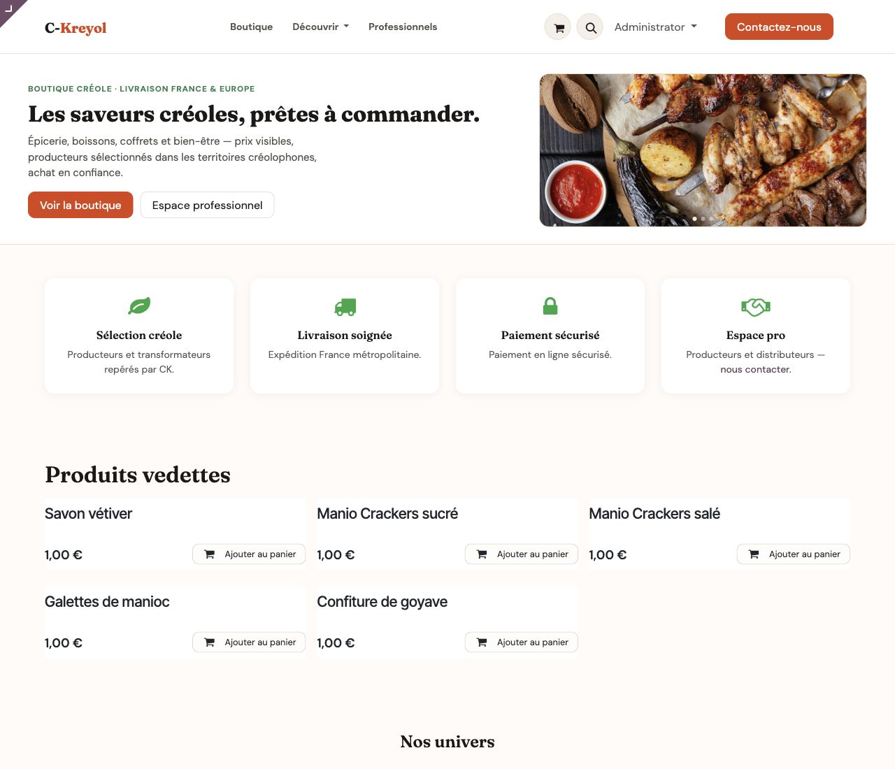
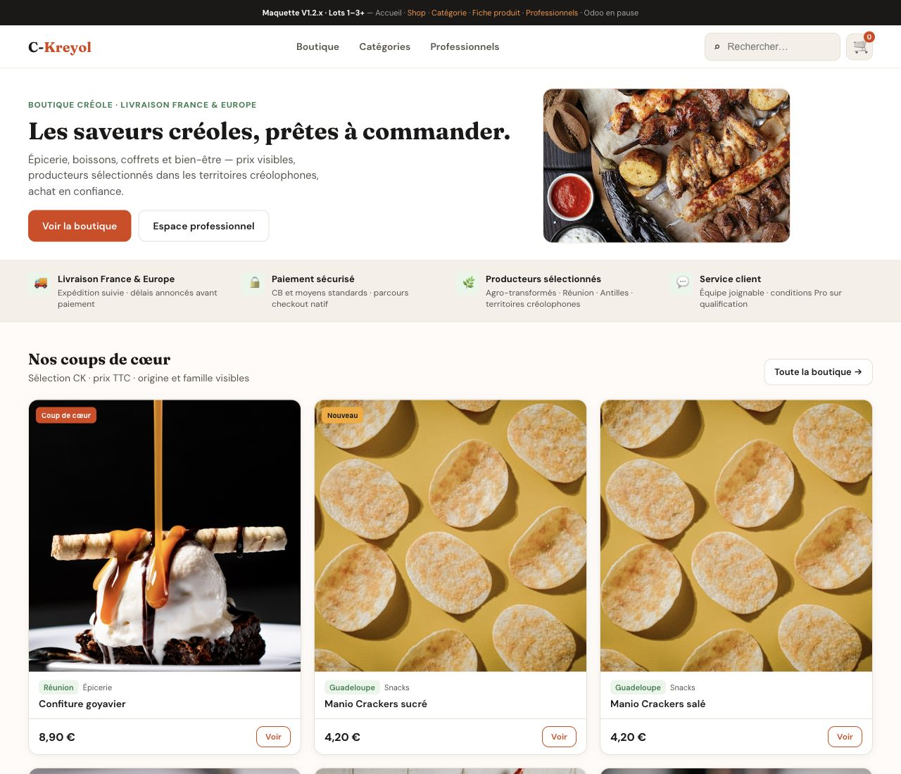
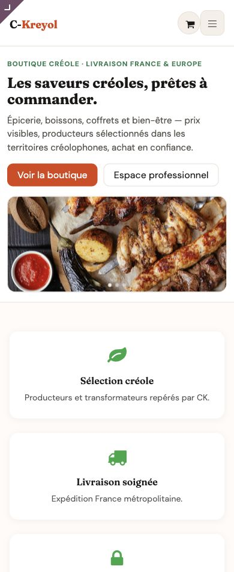
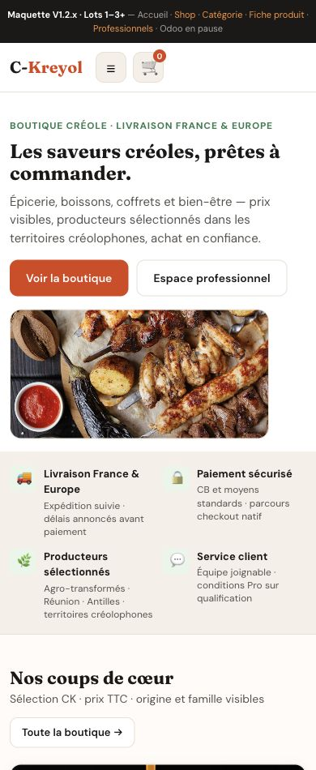

# Recette QA - Rapprochement Home Maquette V1

Date recette : 2026-06-15  
Instance : `http://localhost:18079/?db=dorevia_ck_marketone_01`  
Maquette : `http://127.0.0.1:8766/index.html`  
Modules de reference : `dorevia_ck_theme` `19.0.1.24.0` ; `dorevia_ck_marketone_content` `19.0.1.12.0`

## Verdict

**Option B - GO avec reserves ciblees.**

La Home V1 est coherentisee et exploitable : le Hero V1 est en place, l'ordre cible des blocs est respecte, le rendu ne presente pas d'overflow 1280/390, les textes techniques ne fuitent pas, et les tests automatises Lots 1 a 5 passent.

La cloture pleine du ticket Home V1 reste conditionnee a **3 corrections ciblees maximum**, sans rouvrir les Lots 2 a 5 dans leur perimetre fonctionnel :

1. rendre visibles les images produit des Vedettes ;
2. remplacer ou qualifier le fallback visuel du Coffret ;
3. arbitrer `/promotions`, actuellement en 404 et absent de la Home.

Ces points sont bornes. Ils ne justifient pas une refonte globale ni l'ouverture du Lot 6 avant decision MOA.

## Captures comparatives

### Desktop 1280

Odoo :

Maquette :

### Mobile 390

Odoo :

Maquette :

Captures full-page annexes :

- `captures/recette_home_v1/odoo_home_1280.png`
- `captures/recette_home_v1/maquette_home_1280.png`
- `captures/recette_home_v1/odoo_home_390.png`
- `captures/recette_home_v1/maquette_home_390.png`

## Checklist globale

| Controle | Resultat | Commentaire |
|---|---:|---|
| Desktop 1280 | OK | Pas d'overflow horizontal ; Home lisible. |
| Mobile 390 | OK | Pas d'overflow horizontal document ; empilement propre. |
| Ordre des blocs | OK avec note | Ordre Lots 1-5 respecte ; la reassurance baseline conservee s'intercale entre Hero et Vedettes. |
| Hero lisible | OK | H1 maquette, dual CTA, visuel a droite desktop, empilement mobile. |
| Carrousel Hero | OK | 3 slides, image-only, `data-bs-interval="25000"`, pause hover. |
| Dual CTA | OK | CTA boutique/pro et bloc Pro/Newsletter visibles. |
| Lots 2 a 5 visibles | OK avec reserve | Tous les blocs sont presents ; reserve visuelle sur images Vedettes et Coffret. |
| Absence d'overflow | OK | `scrollWidth` = viewport en 1280 et 390. |
| Absence de texte technique visible | OK | Pas de fuite `maquette`, `snippet CMS`, `Erreur de style`, `s_cover_default_image`. |
| Absence de placeholder image visible | Reserve | Aucun placeholder Odoo detecte ; fallback editorial Coffret visible. |
| Liens principaux | Reserve | `/shop`, `/kits`, `/professionnels`, `/contactus` OK en session navigateur ; `/promotions` 404. |
| Tests automatises Lots 1-5 | OK | `61/61`, `0 failed`, `0 error`. |

## Verdict par bloc

| Bloc | Verdict | Notes QA |
|---|---:|---|
| Header | Hors perimetre | Difference visuelle persistante mais explicitement exclue sauf arbitrage separe. |
| Hero V1 | OK | Tres proche de la maquette : wording, CTA, carrousel, hauteur et comportement responsive valides. |
| Reassurance / categories hautes | OK | Bloc visible et stable ; ecart de style acceptable par rapport a la maquette. |
| Produits vedettes | Reserve ciblee | 5 produits, prix et liens presents ; les visuels produit existent en `background-image` mais leur hauteur calculee est `0px`, donc ils ne sont pas visibles. |
| Categories | OK | Bloc present et lisible. La maquette a une composition plus editorialisee ; polish possible Lot 6. |
| Coffrets decouverte | Reserve ciblee | Bloc present, CTA `/kits` OK ; visuel fallback beige visible au lieu d'une image coffret qualifiee. |
| Dual Pro / Newsletter | OK | Bloc present apres Coffrets, lisible, CTA Pro OK, newsletter native visible. |
| Editorial bas CK | OK | Bloc present avant footer, sans texte technique. |
| Footer | OK | Present ; hors polish global. |

## Mesures DOM relevees

### Desktop 1280

- largeur document : `1280px`
- overflow horizontal : non
- Hero : `273px`
- carrousel Hero : `3` slides, `25000ms`, `pause=hover`
- image Hero : `467x218px`
- placeholders Odoo detectes : aucun
- textes techniques detectes : aucun

### Mobile 390

- largeur document : `390px`
- overflow horizontal : non
- Hero : `426px`
- carrousel Hero : `3` slides, `25000ms`, `pause=hover`
- image Hero : `364x158px`
- placeholders Odoo detectes : aucun
- textes techniques detectes : aucun

## Liens principaux

Controle effectue dans la session navigateur de recette :

| Lien | Resultat | Page cible |
|---|---:|---|
| `/shop` | OK | `Products | C-Kreyol`, H1 `Boutique C-Kreyol` |
| `/kits` | OK | redirection fonctionnelle vers `/shop?marketone_mode=pack` |
| `/professionnels` | OK | `Professionnels | C-Kreyol`, H1 `Espace professionnel` |
| `/contactus` | OK | `Contact | C-Kreyol`, H1 `Nous contacter` |
| `/promotions` | KO | `Page Not Found | C-Kreyol`, H1 `Erreur 404` |

Note : le controle HTTP shell sans session Odoo retourne 404 pour les routes de site car la base n'est pas selectionnee dans cette requete brute. Le verdict ci-dessus repose donc sur le navigateur de recette avec session active.

## Ecarts residuels

### E1 - Vedettes sans images visibles

Priorite : **P1 reserve ciblee**  
Constat : les 5 produits sont presents, avec prix et liens `/shop/...`, mais les zones image des cartes ont une hauteur calculee a `0px`.  
Impact : ecart visuel important par rapport a la maquette ; donne une impression de catalogue incomplet.  
Perimetre correctif conseille : CSS ou template SSR Lot 2 strictement borne pour redonner une hauteur stable aux backgrounds produit, sans changer la logique fonctionnelle.

### E2 - Coffret avec fallback visuel

Priorite : **P1 reserve ciblee**  
Constat : le bloc Coffrets est present, mais affiche un fallback editorial beige au lieu d'une image coffret qualifiee.  
Impact : visible, mais non bloquant fonctionnellement.  
Perimetre correctif conseille : fournir/brancher une image coffret BO ou asset editorial final ; ne pas rouvrir le comportement `/kits`.

### E3 - `/promotions` en 404

Priorite : **P2 arbitrage MOA**  
Constat : `/promotions` n'est pas visible dans la Home actuelle et ouvre une 404.  
Impact : pas de lien casse visible depuis la Home, mais reserve maintenue parce que l'URL figure dans la checklist MOA de recette globale.  
Perimetre correctif conseille : soit creer/mapper la route, soit retirer `/promotions` des criteres Home V1 si elle appartient a un autre chantier.

### E4 - Ecart de richesse visuelle avec la maquette

Priorite : **Lot 6 polish**  
Constat : la maquette reste plus riche sur les cartes produits, les categories et certains rythmes verticaux.  
Impact : acceptable pour Home V1 si E1/E2 sont corriges ; a traiter uniquement dans un Lot 6 borne.  
Perimetre : polish global, pas dans cette recette.

## Hors perimetre confirme

- Header chips et navigation avancee ;
- SEO `/shop`, canonical, meta robots ;
- options Builder Speed / Autoplay ;
- Chantier B ;
- scripts QA Playwright locaux non commités ;
- refonte des cartes produits au-dela du correctif d'images visibles ;
- Lot 6 avant verdict MOA.

## Recommandation finale

Recommandation QA : **GO avec reserves ciblees**.

La Home V1 peut etre consideree comme techniquement industrialisee et globalement coherente, mais pas encore cloturable en **GO Home V1 plein** tant que les images des Vedettes et du Coffret ne sont pas corrigees ou arbitrees. La suite doit rester bornee a ces reserves, puis seulement ensuite ouvrir un Lot 6 polish si la MOA le souhaite.
