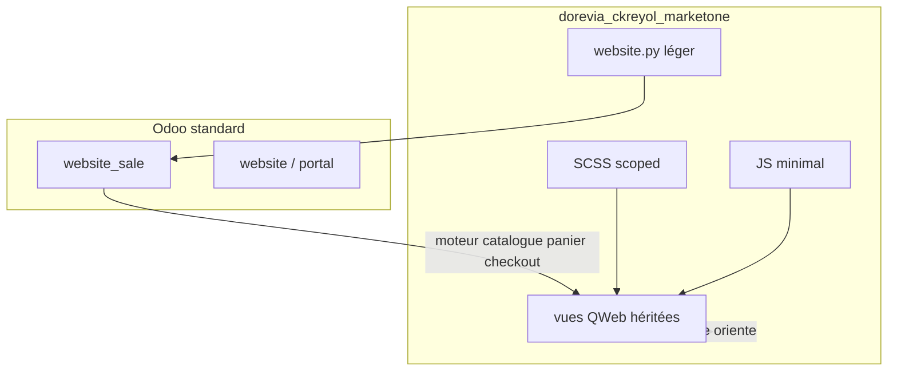

# Architecture — `dorevia_ckreyol_marketone`

| Champ | Valeur |
|-------|--------|
| **Module** | `dorevia_ckreyol_marketone` |
| **Odoo** | 19 Community Edition |
| **Statut** | Cadrage Lot 0 — aucun code produit |
| **Référence** | `dorevia_ckreyol_marketplace` (inspiration conceptuelle uniquement) |

---

## 1. Rôle du module

**Marketone** est la couche de présentation et d’orientation du canal e-commerce C-Kreyol. Il ne remplace pas `website_sale`.

```text
Odoo vend.          → panier, checkout, paiement, catalogue moteur
Marketone présente. → identité, UX, éditorial, navigation, lisibilité retail
```

C-Kreyol (`CK`) est un canal e-commerce qui a vocation à proposer une offre de produits dont la particularité est d'être produits dans des zones géographiques où l'on parle créole. Le canal est éditorialisé autour de cette offre. Il ne doit pas être réduit à un simple site de produits antillais, à une boutique exotique, à une marketplace générique, ni à un site uniquement agro-transformé.

La notion centrale est :

```text
produits issus de territoires créolophones
```

Cela inclut une logique de territoire, de langue, de culture, de production et de transmission. Le module doit rester crédible pour une ouverture commerciale réelle, mobile-first, sobre et maintenable.

---

## 2. Doctrine produit C-Kreyol

Le site C-Kreyol porte trois dimensions complémentaires.

### 2.1 E-commerce

Vendre une sélection de produits issus de territoires créolophones.

C'est la colonne vertébrale du parcours :

```text
Accueil → Boutique → Produit → Panier → Commande
```

Le parcours d'achat doit rester **simple, rapide, clair et fiable**.

Dans Marketone, `website_sale` reste souverain sur cette dimension : catalogue, panier, checkout et paiement.

### 2.2 Éditorial culturel

Raconter les territoires, les langues, les producteurs, les usages, les histoires, les imaginaires et les savoir-faire liés aux mondes créolophones.

Cette dimension donne du sens aux produits. Elle doit enrichir l'expérience sans perturber l'achat.

### 2.3 Partage de connaissance

Transmettre des repères : origine des produits, modes d'usage, recettes, vocabulaire, traditions, techniques de transformation, pratiques culinaires ou artisanales.

Cette dimension peut devenir plus tard une vraie bibliothèque de savoirs autour des mondes créolophones.

### 2.4 Agencement des dimensions

Deux écueils sont à éviter :

1. Faire une boutique pure : C-Kreyol devient un simple site marchand.
2. Mélanger commerce, culture et savoir partout : le parcours d'achat devient confus.

Doctrine d'agencement :

```text
Le produit d'abord.
Le récit ensuite.
Le savoir en prolongement.
```

Version courte :

```text
C-Kreyol articule trois dimensions — vendre, raconter, transmettre — sans jamais les confondre.
```

Conséquence pour Marketone :

```text
Lots 1-5 : sécuriser le socle e-commerce
Lot 6 : portes catalogue
Lots suivants : premières couches éditoriales et connaissance
```

Cela implique :

- ne pas injecter trop tôt des contenus culturels lourds dans `/shop` ;
- ne pas transformer la fiche produit en article encyclopédique ;
- ne pas brouiller le CTA d'achat ;
- ne pas créer une navigation complexe avant que le socle boutique soit stable ;
- préparer la possibilité éditoriale sans l'implémenter prématurément.

---

## 3. Périmètre technique

### Inclus (par lots progressifs)

| Couche | Rôle |
|--------|------|
| **Assets SCSS** | Tokens, layout, pages (home, shop, product) — scope `.marketone-*` |
| **Assets JS** | Uniquement si SCSS/QWeb ne suffit pas |
| **Vues QWeb** | Héritages légers de `website.layout`, pages home/shop, snippets |
| **Contrôleur minimal** | Routes éditoriales éventuelles — pas de moteur catalogue |
| **Modèle `website`** | Extensions légères (canonical, slots homepage si besoin validé) |
| **Tests** | Smoke install, puis contrats par périmètre (shop, cart, checkout) |
| **Documentation** | `cadrage/CONTRACTS.md`, `cadrage/DECISIONS.md`, tickets par lot |

### Exclus du socle initial

- Moteur catalogue, panier ou checkout parallèle
- Modèles `ckr.shop.collection`, origines éditoriales, CRM, newsletter
- Portes catalogue (promotions, kits, origines, collections) — **Lot 6+**
- Thème tiers obligatoire (`theme_classic_store`)
- Dépendances opportunistes (`mass_mailing`, `website_crm`, `product_pack`, etc.)

---

## 4. Dépendances

### Obligatoires (Lot 1)

```text
website
website_sale
portal
```

### Optionnelles (activation uniquement après besoin MOA validé)

| Module | Usage potentiel |
|--------|-----------------|
| `website_sale_wishlist` | Favoris |
| `website_crm` | Formulaires contact / pro |
| `mass_mailing` | Newsletter |
| `product_pack` | Porte Kits/Packs |
| `theme_classic_store` | **Non retenu** — source de dette XPath/CSS |

---

## 5. Structure cible du module

```text
dorevia_ckreyol_marketone/
├── __init__.py
├── __manifest__.py
├── controllers/
│   ├── __init__.py
│   └── main.py              # minimal — pas de surcharge shop lourde au Lot 1
├── models/
│   ├── __init__.py
│   └── website.py           # extensions légères
├── security/
│   └── ir.model.access.csv
├── data/                    # vide au Lot 1 ; pas de seed prod obligatoire
├── views/
│   ├── layout/
│   │   └── website_layout.xml
│   ├── pages/
│   │   ├── home.xml
│   │   └── shop.xml         # héritages sobres, xpath sur #wrap si possible
│   └── snippets/
│       └── snippets.xml
├── static/src/
│   ├── scss/
│   │   ├── marketone.scss   # point d’entrée bundle
│   │   ├── _tokens.scss
│   │   ├── _layout.scss
│   │   ├── _home.scss
│   │   ├── _shop.scss
│   │   └── _product.scss
│   └── js/
│       └── marketone.js     # vide ou minimal au Lot 1
├── tests/
│   ├── __init__.py
│   └── test_marketone_smoke.py
└── docs/
    ├── README.md
    ├── cadrage/
    │   ├── BRIEF_INITIAL.md
    │   ├── ARCHITECTURE.md
    │   ├── CONTRACTS.md
    │   └── DECISIONS.md
    ├── pilotage/
    │   └── ROADMAP.md
    ├── recette/
    │   └── ENV_REFERENCE.md
    └── tickets/
        └── TICKET_MARKETONE_LOT0_CADRAGE.md
```

**Préfixe CSS/QWeb** : `marketone_` / classes `marketone-*` — distinct de `ckr_*` du module legacy pour éviter les collisions si co-installation accidentelle.

---

## 6. Séparation des responsabilités



| Responsabilité | Propriétaire |
|----------------|--------------|
| Domaine produits, prix, stock | Odoo `product` + `website_sale` |
| Filtres catalogue (futur Lot 6) | Hook `_search_get_detail` sur `product.template` |
| Rendu grille, panier, tunnel | Templates `website_sale` |
| Identité visuelle, espacements, typo | Marketone SCSS |
| Pages éditoriales home | Marketone QWeb + snippets |
| Canonical URL shop | `website` (extension) — aligné doctrine conteneur unique |

---

## 7. Enseignements de `dorevia_ckreyol_marketplace`

### À conserver comme principes

1. **Filtres catalogue centralisés** dans `product.template._search_get_detail` via options passées par le contrôleur — pas de domaine parallèle en QWeb.
2. **`/shop` conteneur unique** — facettes en query string (doctrine gelée marketplace, voir `docs/mvp_02/DOCTRINE_SHOP_CONTENEUR_UNIQUE.md` dans l’ancien module).
3. **Whitelist stricte** des paramètres URL ; priorité déterministe des modes.
4. **Tests taggés** par périmètre avec jeux de données reproductibles.
5. **Séparation** models / controllers / views / assets / tests / docs.
6. **Mobile-first** : header mesuré, pas de hero rotatif au socle.

### À ne pas recopier

| Dette legacy | Détail |
|--------------|--------|
| Manifeste-journal | ~430 lignes de changelog dans `description` |
| Monolithes | `website_sale_ckr.py` (~1870 L), `_shop.scss` (~3363 L), `ckr_shop.xml` (~1046 L) |
| Thème tiers | `theme_classic_store` + `ckr_shop_classic_tile_restore.xml` |
| CSS défensif | `<style>` inline QWeb, `!important` en masse, guerre de spécificité |
| XPath fragiles | Réparation structure DOM thème ; priorités 50–100 |
| Migrations | 11 scripts historiques |
| Features hors socle | CRM pro, rappel, newsletter, hero rotator, 6 fichiers JS |
| État sur `request` | `_ckr_collection_ctx`, exceptions comme flux 302 |
| Doc contradictoire | Collections « URL nobles » vs redirects 301 actuels |

---

## 8. Stratégie d’intégration `website_sale`

### Lot 3 — Boutique

- Hériter `website_sale.products` (ou équivalent Odoo 19) avec **peu** de xpath, ciblant `#wrap` ou conteneurs stables.
- Ajuster lisibilité cartes (espacement, typo, CTA) via SCSS scoped `.marketone-shop`.
- **Ne pas** remplacer la tuile produit par un template parallèle dépendant d’un thème tiers.

### Lot 4 — Fiche produit

- Héritages légers pour blocs éditoriaux **si** les champs produit existent et sont propres.
- Pas de merchandising inventé sans données BO.
- Ne pas transformer la fiche produit en article encyclopédique : le produit et le CTA d'achat restent prioritaires ; récit et savoir viennent en appui.

### Lot 5 — Panier / checkout

- Tests smoke et E2E sur le tunnel **standard**.
- Micro-ajustements visuels uniquement ; pas de refonte checkout.

### Lot 6 — Portes catalogue

- Réintroduire la matrice fonctionnelle marketplace (promo, pack, featured, origin, collection, category) **une porte à la fois**.
- Alias HTTP 301 → `/shop?marketone_mode=…` (noms de paramètres à figer dans `cadrage/CONTRACTS.md` avant implémentation).
- Une seule couche : options contrôleur → `_search_get_detail` — éviter double mécanisme `request._*`.

---

## 9. Assets front

### SCSS

- **Tokens** en tête (`_tokens.scss`) : couleurs C-Kreyol, typo, espacements.
- **Scope** : racine `.marketone-root` sur `#wrap` ou `body` pour ne pas polluer le BO.
- **Ordre bundle** : tokens → layout → pages ; pas de monolithe shop de 3000+ lignes.

### JavaScript

Règle : pas de JS si SCSS ou QWeb suffit.

| Cas légitime (plus tard) | Exemple legacy à éviter au socle |
|--------------------------|----------------------------------|
| Drawer header accessible | 6 fichiers JS dès le Lot 1 |
| Mesure header pour hero | Hero rotateur + ResizeObserver |
| Accordéon footer | MutationObserver sans Bootstrap |

---

## 10. Tests

| Lot | Test minimal |
|-----|----------------|
| 1 | `test_marketone_smoke` — module installable, assets chargés |
| 3 | Contrat `/shop` rendu 200, structure attendue |
| 5 | Panier invité + progression checkout sans 500 |
| 6 | Un tag par porte (`dorevia_marketone_promo`, etc.) |

Exécution ciblée : `--test-tags=dorevia_marketone_smoke` (convention à confirmer au Lot 1).

---

## 11. Coexistence avec l’ancien module

**Recommandation** : ne pas installer `dorevia_ckreyol_marketplace` et `dorevia_ckreyol_marketone` sur la même base.

Risques en co-installation : conflits de routes, xpath, assets, préfixes CSS.

Si migration de base : désinstaller l’ancien module après bascule validée MOA, pas de chevauchement prolongé.

---

## 12. Chaîne documentaire

| Fichier | Contenu |
|---------|---------|
| `README.md` | Index de documentation |
| `cadrage/BRIEF_INITIAL.md` | Brief et doctrine de départ |
| `cadrage/ARCHITECTURE.md` | Ce document |
| `pilotage/ROADMAP.md` | Lots et critères GO |
| `cadrage/CONTRACTS.md` | Contrats fonctionnels figés (URL, shop, portes futures) |
| `cadrage/DECISIONS.md` | ADR et arbitrages datés |
| `tickets/TICKET_*.md` | Tickets d’exécution par lot |

Le manifeste Odoo reste **sobre** : nom, version, dépendances, assets — pas de journal de versions.

---

## 13. Réserve Lot 0

Ce document décrit l’architecture **cible**. Aucun fichier Python, XML, SCSS ou JS n’existe encore dans le module (hors cette documentation). Le socle technique (Lot 1) nécessite une validation humaine explicite après revue du ticket Lot 0.
