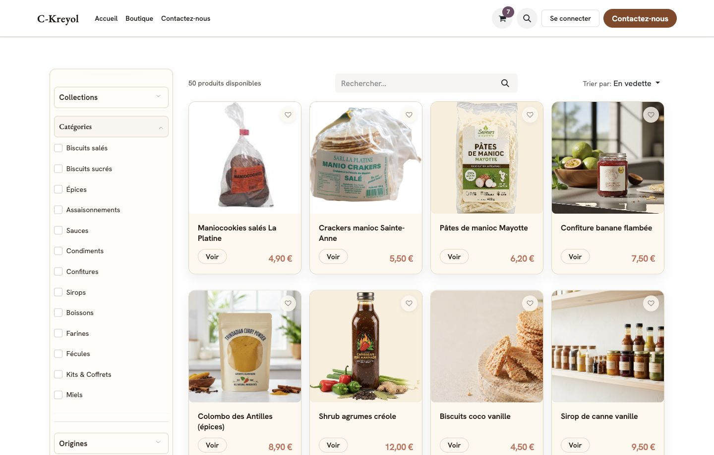
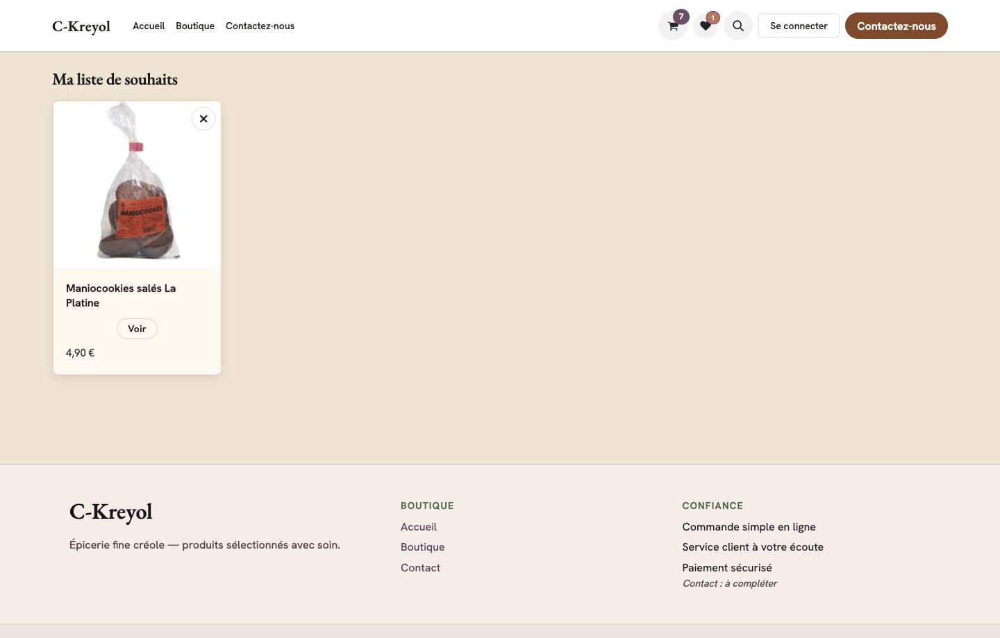
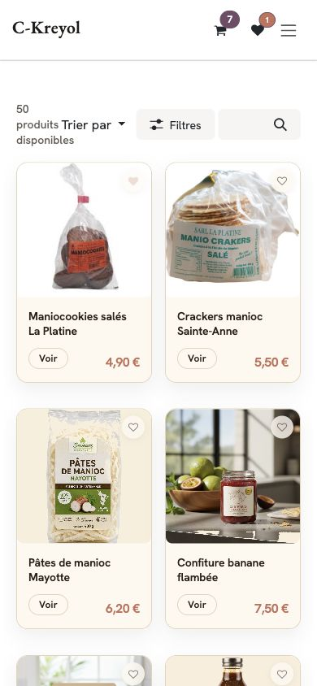
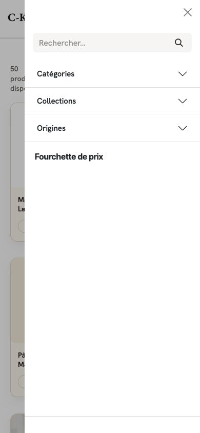

# Rapport recette visuelle — Wishlist standard Odoo

| Champ | Valeur |
|-------|--------|
| Recette | [`RECETTE_VISUELLE_WISHLIST_STANDARD.md`](./RECETTE_VISUELLE_WISHLIST_STANDARD.md) |
| Module | `dorevia_ckreyol_marketone` |
| Version cible | **`19.0.15.10.3`** |
| Base | `ckr-marketone-01` |
| URL | http://localhost:18079 |
| Date | 2026-05-22 |
| Exécuteur | MOA / Codex |

## Résultat synthétique

**Verdict : GO MOA — périmètre visiteur public.**

La wishlist standard Odoo est activée avec cosmétique CK. Ajout / retrait visiteur non connecté, page `/shop/wishlist`, header et non-régression boutique validés. Régression mobile B6 et réserve cosmétique R2 (offcanvas Collections) clôturées en `10.2` / `10.3`.

**Réserve documentaire :** scénarios connecté / fusion session P3–P6 — compte test MOA non fourni · ne bloque pas le GO.

## Tests automatisés

Résultat final : **75 tests, 0 failed, 0 error(s)** (tags wishlist + régression boutique).

## Grille de constats

| Zone | Desktop | Mobile | Verdict |
|------|---------|--------|---------|
| Header wishlist | Compteur 0 → 1 → 0 | Icône visible | OK |
| Card — repos / retenu | Cœur discret · ajout OK | Grille OK | OK |
| Fiche produit | Wishlist secondaire | — | OK |
| Page wishlist | Pleine / vide standard | — | OK |
| Non-régression `/shop` | UX-1 · sidebar · cards | Offcanvas B6 + R2 OK | OK |
| Connecté / non connecté | P1 · P7 visiteur | P3–P6 reportés | Réserve doc. |

## Captures

## Verdict

| Décision | Statut |
|----------|--------|
| **GO** — activation wishlist standard validée | **X** |
| GO avec réserves | |
| NO GO | |

Voir aussi : [`RAPPORT_RECETTE_WISHLIST_REGRESSION_BOUTIQUE_20260522.md`](./RAPPORT_RECETTE_WISHLIST_REGRESSION_BOUTIQUE_20260522.md)
