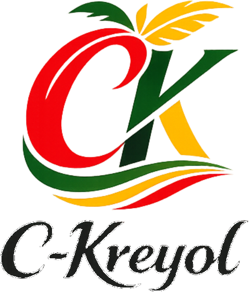

# C-Kreyol — Canal e-commerce spécialisé

**Dorevia** pour le projet : **C-Kreyol** — canal e-commerce spécialisé.

**C-Kreyol** est une **marque** et un **canal de vente en ligne spécialisé**, qui **commercialise** des **produits agro transformés antillais** **sans** porter **nécessairement** tout le **stock** ni toute la **logistique physique**, en s’appuyant sur un **réseau de fournisseurs** dont **La Platine** est le **premier**.

**La Platine** est ainsi le **premier fournisseur** de ce réseau et un **point d’appui commercial** au démarrage, sans que C-Kreyol ait vocation à se confondre avec le site ou l’identité de La Platine ni à n’être qu’une extension de son activité.

**Localisation** : **C-Kreyol est localisé à Nantes** (France). Cet ancrage doit à terme soutenir non seulement le **canal commercial** et la **relation client**, mais aussi une compétence réelle en **logistique import-export**, au service de la mise en marché de produits agro transformés antillais — avec la nuance que l’**origine produit** reste **antillaise** alors que l’**opération** est **métropolaine**. Détail des **modèles logistiques** possibles (pur canal, hub léger, montée en puissance) : voir **[§4.4 de la note de cadrage](docs/NOTE_DE_CADRAGE.md)**.

## Identité visuelle

Logo officiel (fond transparent), fichier versionné : `static/description/c_kreyol_logo.png`.



### Références visuelles homepage (Phase 1 — documentation)

Fichiers **PNG versionnés** sous [`docs/assets/`](docs/assets/) pour le **cadrage** et, plus tard, l’**intégration** front (hero, blocs catalogue, vignettes) :

| Fichier | Rôle (résumé) |
|---------|----------------|
| `exemple_produit_manioc_crackers_la_platine.png` | Exemple produit réel (packaging lisible) — voir [spec hero homepage](docs/SPEC_HERO_HOMEPAGE.md). |
| `hero_reference_direction_a_biscuits_confiture.png` | Moodboard **macro / matière** pour la direction hero gelée — voir [brief visuel hero](docs/BRIEF_VISUEL_HERO_PHASE1.md) (section 10.2). |
| `homepage_maniocookies_sale_la_platine.png` | **Banque homepage** : packshot Maniocookies (La Platine). |
| `homepage_manioc_crackers_sale_ste_anne.png` | **Banque homepage** : packshot crackers manioc salés (Sainte-Anne). |
| `homepage_manioc_pates_mayotte_la_platine.png` | **Banque homepage** : packshot pâtes manioc (Mayotte). |

**Usages** des trois packshots (vignettes, blocs sélection, pas hero seul) : [brief visuel hero — section 10.3](docs/BRIEF_VISUEL_HERO_PHASE1.md) et [spec hero — banque photos homepage](docs/SPEC_HERO_HOMEPAGE.md). La [charte graphique Phase 1](docs/CHARTE_GRAPHIQUE_PHASE1.md) renvoie à ces fichiers en 7.2.

---

## Statut du dépôt

**Phase 1 — implémentation front livrée et clôturée côté bilan** (voir **[rapport de phase MOA](docs/rapport_phase_1.md)**). Le module `dorevia_ckreyol_marketplace` est **installable** sur **Odoo 19 Community Edition** (dépendances `portal`, `website`, `website_sale`). Il fournit notamment :

- un **header** avec **menu principal personnalisé** (Option B : Boutique / Collections / Offrir / Recettes / À propos / Contact), utilitaires (recherche, compte, panier), **menu compte** et **drawer mobile** ;
- **langue et devise** : réemploi des mécanismes natifs Odoo (sélecteur langue inline + codes, pricelists) — prérequis exploitation : **[EXPLOITATION_I18N_DEVISES.md](docs/EXPLOITATION_I18N_DEVISES.md)** ;
- une **page de connexion** `/web/login` orientée « Mon compte » (masquage d’éléments techniques superflus, charte) ;
- le **portail** `/my` (scope et styles d’ensemble) ;
- la **boutique** `/shop` et la **fiche produit** (scopes dédiés + SCSS : cartes, filtres, CTA, rubans produits, etc.) ;
- un **footer** personnalisé (4 colonnes ; alignement **`res.company`** — voir § BAC-01 ci-dessous) ;
- une **homepage** conforme au [wireframe](docs/WIREFRAME_HOMEPAGE.md) (variante retail enrichie) et au [spec hero](docs/SPEC_HERO_HOMEPAGE.md), avec bloc **Explorer** (5 portes au **pluriel**) : **Promotions**, **Collections**, **Kits**, **Catégories**, **Origines** — toutes convergeant à terme vers la boutique ([ADR-CKR-007](docs/ARCHITECTURE_DECISION_RECORD.md#adr-ckr-007)) ; **UI** : rail horizontal **manuel** (sans autoplay), boutons précédent/suivant — détail [WIREFRAME — Bloc 3](docs/WIREFRAME_HOMEPAGE.md). **Trois portes déployées** : (a) **Kits** (v19.0.1.1.0) — bi-lexique [ADR-008](docs/ARCHITECTURE_DECISION_RECORD.md#adr-ckr-008), `/kits` → **301** → `/shop?ckr_mode=pack`, `pack_ok`, stub retiré ([CONTRAT_URL_PACKS §12-13](docs/phase_2/CONTRAT_URL_PACKS.md)) ; (b) **Promotions** (v19.0.1.2.0) — A2 pricelist, `/promotions` → **301** → `/shop?ckr_mode=promo`, bandeau + état vide ([CONTRAT_URL_PROMOTIONS §12-13](docs/phase_2/CONTRAT_URL_PROMOTIONS.md)) ; (c) **Catégories** (v19.0.1.3.0) — **H1 variante cible native** : `/categories` → **301** → `/shop/category/<id>-<slug>` (sans `ckr_mode`, filtre 100 % `website_sale`, résolveur `product.public.category._ckr_get_explorer_entry_shop_path`, paramètre système optionnel — [CONTRAT_URL_CATEGORIES §12-13](docs/phase_2/CONTRAT_URL_CATEGORIES.md)). Patrons formalisés : H1 avec `ckr_mode` (Pack, Promo) ; H1 **sans** `ckr_mode` quand le standard expose déjà l’URL canonique (Catégories). **Suite** : **Origines** = **priorité** — porte à **dimension éditoriale** (navigation + mise en scène sur `/shop`, pas réduction à un tag seul — [SPEC_SHOP_PORTES §4.5](docs/phase_2/SPEC_SHOP_PORTES.md)) ; cadrage détaillé : **[CONTRAT_URL_ORIGINES.md](docs/phase_2/CONTRAT_URL_ORIGINES.md)** — **§13** : arbitrages métier **verrouillés** (multi + **OU**, signal **§3.1**, `/shop` sans hub v1, repli invalide, vide dédié, fiche produit) ; **§12** : résidu PV / impl (**A1↔A2**, URL, copy) avant dev — brouillon technique : [SPEC_IMPL_ORIGINES.md](docs/phase_2/SPEC_IMPL_ORIGINES.md). **Collections** = stub conservé mais **chantier gelé** (spec métier/URL/front **ultérieur** — [SPEC_SHOP_PORTES §4.2](docs/phase_2/SPEC_SHOP_PORTES.md)). Capitalisation : [CONTRAT_URL_PROMOTIONS §13.6](docs/phase_2/CONTRAT_URL_PROMOTIONS.md) ;
- **cohérence visuelle** Direction A (terracotta / sauge / amber / off-white / charcoal ; Playfair Display + Inter) et **mobile** utilisable (drawer, grilles responsives).

Principe directeur : **respect maximal d’Odoo 19 CE** — sur-mesure limité au front présentationnel ; pas de logique métier parallèle.

**Structure du module** (indicatif) :

```
dorevia_ckreyol_marketplace/
├── __manifest__.py
├── data/                 pages website, activation sélecteurs langue (variantes natives)
├── views/
│   ├── layout/           header + footer
│   ├── auth/             login « Mon compte »
│   ├── portal/           habillage portail /my
│   ├── pages/            homepage, stubs, scope boutique + fiche produit
│   └── snippets/         blocs homepage (hero, Explorer, supplier, sélection, éditorial, trust)
├── docs/                 cadrage, backlog 1bis, rapport phase 1, ADR, exploitation i18n
├── hooks.py              menu Option B (post_init)
└── static/src/
    ├── js/               drawer + menu compte
    ├── scss/             tokens, layout (_header, _locale, _login, _portal, _product, _shop, …), components, ckr_main.scss
    └── img/              hero + packshots (copies depuis docs/assets/)
```

> **Suite logique** (hors périmètre du rapport Phase 1 clôturé) : panier `/shop/cart`, puis checkout — voir [rapport_phase_1.md — §6](docs/rapport_phase_1.md). **Doctrine homepage / portes catalogue** : [ADR-006 à 008](docs/ARCHITECTURE_DECISION_RECORD.md#adr-ckr-006), [WIREFRAME homepage — Bloc 3](docs/WIREFRAME_HOMEPAGE.md), [STRUCTURE_MENU — §11](docs/STRUCTURE_MENU_PRINCIPAL.md). Polissage transversal : [BACKLOG_PHASE_1BIS_FRONT.md](docs/BACKLOG_PHASE_1BIS_FRONT.md). Polissage copy, assets définitifs et richesse catalogue restent pilotés côté métier.

### Configuration société (BAC-01 — prérequis ouverture)

Le **footer du site** lit la **`res.company`** rattachée au **site web** courant (injection standard `res_company` dans les QWeb *website*, cf. `website/models/ir_qweb.py`). Les champs renseignés en **Paramètres → Sociétés → [votre société]** s’affichent ainsi dans le footer et restent **alignés** avec les **en-têtes des e-mails transactionnels**, **devis / factures** et autres documents Odoo qui utilisent la même société.

| Champ (vue société) | Effet sur le footer |
|---------------------|---------------------|
| **Nom** | Ligne copyright : `©` + raison sociale. |
| **Ville** et **Pays** | Affichés après le nom si renseignés (ex. `Nantes, France`). L’adresse complète (rue, CP…) reste indispensable pour les **PDF** et la conformité, même si seule la ville/pays apparaissent dans cette ligne courte. |
| **E-mail** | Lien `mailto:` dans la colonne **Contact** (en plus du formulaire `/contact`). |
| **Téléphone** | Lien `tel:` (espaces et tirets retirés dans l’URL pour une meilleure compatibilité mobile). |
| **Site web** | Lien externe (schéma `https://` ajouté automatiquement si le champ ne commence pas par `http://` ou `https://`). |

**Logo** : le bloc marque du footer conserve le **logo charte** versionné dans le module (`static/description/c_kreyol_logo.png`). Le **logo société** chargé dans Odoo sert surtout aux **documents** et au **back-office** : veillez à ce qu’il soit **visuellement cohérent** avec la charte C-Kreyol pour éviter une rupture d’identité côté client (e-mails, PDF).

**Multi-société / multi-sites** : chaque `website` pointe vers une société ; le footer affiche automatiquement la bonne `res_company`.

**Mise à jour** : les changements dans la fiche société sont visibles au **rechargement** du site. Un **`-u dorevia_ckreyol_marketplace`** n’est nécessaire que lorsque le **code** du module (vues, SCSS) change.

**Cadrage orienté implémentation** : le projet attaque maintenant le **cadrage détaillé en vue de la mise en œuvre sur Odoo 19 Community Edition** (arbitrages métier, juridique, logistique, périmètre fonctionnel V1, lots de travail). Les documents de travail pour cette phase sont la **[note de cadrage Phase 1](docs/NOTE_DE_CADRAGE.md)**, le **[registre des décisions d’architecture (ADR)](docs/ARCHITECTURE_DECISION_RECORD.md)** (y compris **ADR-CKR-006 à 008** : homepage d’orientation, convergence `/shop`, cinq portes d’exploration catalogue), le **[cadrage design / front-end](docs/DESIGN.md)**, la **[structure cible du menu principal](docs/STRUCTURE_MENU_PRINCIPAL.md)**, le **[wireframe homepage Phase 1](docs/WIREFRAME_HOMEPAGE.md)** , la **[spec hero homepage](docs/SPEC_HERO_HOMEPAGE.md)**, le **[brief visuel hero Phase 1](docs/BRIEF_VISUEL_HERO_PHASE1.md)**, le **[brief développeur front Phase 1](docs/BRIEF_DEV.md)** et la **[charte graphique minimale Phase 1](docs/CHARTE_GRAPHIQUE_PHASE1.md)** et le **[brief synthétique direction artistique Phase 1](docs/BRIEF_SYNTHETIQUE_CK.md)** et les **[directions artistiques Phase 1](docs/DIRECTIONS_ARTISTIQUES_PHASE1.md)** (3 pistes + recommandation) — **ADR-CKR-001** (doctrine de construction Phase 1 sur Odoo 19 CE), **ADR-CKR-002** (seul le **front-end** est spécifique présumé légitime en Phase 1 ; le reste = standard et modules activables d’abord), **ADR-CKR-003** (**menu principal** et **footer** entièrement personnalisés en Phase 1 pour l’identité du canal), **ADR-CKR-004** (**achat-revente** : **C-Kreyol** vend au client final, **encaisse**, **achète** à **La Platine**) et **ADR-CKR-005** (**hub léger** à **Nantes**, **flux tendu**, **stock consigné** — détail juridique / Odoo à affiner dans la note §5.4). **Dossier Phase 2** (homepage, Explorer, plan portes) : **[docs/phase_2/README.md](docs/phase_2/README.md)**.

---

## Objectif chiffre d’affaires (horizon 3 ans)

**Ambition projet : 1 000 k€ (1 M€) de chiffre d’affaires à horizon 3 ans.**

- Il s’agit d’un **objectif déclaré** pour cadrer les priorités (offre, canaux, opérations), **pas** d’une prévision comptable ni d’un engagement envers des tiers.
- **Jauge à préciser** (à trancher et à refléter ici quand ce sera figé) : par exemple CA **annuel** au terme de la 3e année civile ou d’exercice, **moyenne** sur trois ans, ou **cumul** sur les trois exercices — la formulation exacte influence le pilotage (stock, équipe, marketing).

L’objectif CA doit rester **cohérent** avec la vision et les critères de succès **court terme** (premières ventes, récurrence, panier moyen) ; un plan financier détaillé, s’il est produit, pourra vivre dans un document séparé.

---

## Vision et mission

**Vision (à moyen terme, alignée avec l’horizon 3 ans)**  
Faire de **C-Kreyol** une marque et un canal en ligne **crédibles et identifiables** pour les produits agro transformés antillais : qualité perceptible, origine lisible, **parcours client et promesses logistiques tenues** (y compris via les partenaires), et une expérience digne de la confiance des clients (France, Outre-mer, diaspora selon arbitrages).

Le projet est pensé pour **naître avec un premier fournisseur réel**, **La Platine**, puis évoluer vers une activité commerciale plus autonome, capable à terme de porter une offre plus large que son point de départ initial.

**Mission**  
La mission de **C-Kreyol** : **valoriser l’offre alimentaire locale** et **proposer un accès en ligne sérieux** à des **produits agro transformés** issus des **Antilles**.

**Livrabilité minimale (V1 « boutique qui vit »)**  
Permettre de **vendre en ligne** un catalogue maîtrisé : fiches produits honnêtes, panier, paiement, livraison ou retrait selon le modèle retenu, pages légales et contact clairs — **y compris un parcours mobile web** (smartphone) **utilisable et sérieux** — **sans** attendre la perfection graphique ou fonctionnelle.

En phase initiale, l’enjeu est d’ouvrir un **canal de vente qui fonctionne réellement**, avant toute ambition de marketplace multi-vendeurs à grande échelle.

---

## Publics et valeur

| Public | Rôle |
|--------|------|
| **Acheteurs** | Particuliers et/ou professionnels (à trancher) cherchant des produits agro transformés des Antilles, circuit court ou identité forte. |
| **Offreurs** | **Réseau de fournisseurs** : en V1, **La Platine** en est le **premier** ; d’autres producteurs, transformateurs ou marques locales pourront s’ajouter selon les arbitrages. C-Kreyol ne vise pas à **internaliser par défaut** tout le stock ni toute la logistique physique. |

**Promesse de valeur (brouillon)** : origine et qualité, soutien à l’économie agroalimentaire antillaise, expérience d’achat simple et traçable.

---

## Positionnement initial

**C-Kreyol n’est pas le site de La Platine.**  
Le canal se lance avec **La Platine comme premier fournisseur** du réseau et point d’appui commercial, mais C-Kreyol a vocation à devenir un **actif commercial autonome**, porté par une **marque** qui lui est propre.

**Modèle retenu (cadrage)** : marque + **canal retail digital** spécialisé ; **pas d’obligation** pour C-Kreyol de porter l’intégralité du stock ni de toute la chaîne logistique physique — celles-ci peuvent rester **chez les fournisseurs** ou être **hybrides**, selon les produits et les accords (à détailler en Phase 1).

**Hypothèse de modèle opératoire privilégiée**  
C-Kreyol **pourrait** fonctionner **sans stock centralisé systématique**, en s’appuyant sur des **fournisseurs partenaires** chargés de la **préparation** ou de l’**expédition** de tout ou partie des commandes, tandis que C-Kreyol porterait la **marque**, le **canal de vente**, l’**expérience client** et l’**orchestration commerciale**. Cette hypothèse reste **à valider** (juridique, fiscal, qualité, responsabilité vis-à-vis du client final) avant de la figer comme mode de fonctionnement par défaut.

Cette distinction implique notamment que :

- **La Platine**, **premier fournisseur** du réseau, apporte au démarrage produits, crédibilité, ancrage réel et premiers flux potentiels ;
- **C-Kreyol** construit en parallèle sa propre existence comme **marque**, canal de vente, expérience client et capacité de **sélection commerciale** (voire distribution), sans se limiter au seul périmètre La Platine à terme.

En conséquence, la phase initiale doit être pensée comme une **boutique e-commerce spécialisée** (souvent **mono-fournisseur dominant** au départ), et non comme une marketplace multi-vendeurs pleinement constituée dès le départ.

---

## Périmètre fonctionnel visé (brouillon — à valider)

- Site e-commerce (catalogue, fiche produit, panier, tunnel de commande).
- **Paiement** : prestataire(s) et devise(s) — à valider.
- **Livraison** : transporteurs, zones, point relais ou retrait — à valider.
- **Pages légales** : CGV, mentions légales, politique de confidentialité — obligatoires avant ouverture au public.
- Compte client (connexion, historique de commandes) — souhaitable dès V1 si charge acceptable.
- Newsletter / lettre d’information — optionnelle V1.
- **Langue(s)** du site — à valider (FR minimum probable).
- **Expérience mobile (navigateur)** — **must have** pour la V1 : parcours e-commerce **complet et de qualité** sur smartphone (responsive / mobile-first, tests réels), sans viser une application native dédiée.

---

## Hors périmètre explicite (surtout au démarrage)

- Marketplace **multi-vendeurs** type grand agrégateur (complexité juridique, commission, modération) — **hors V1** sauf décision contraire explicite.
- **Application mobile native** — hors périmètre initial ; l’**expérience mobile via le site web** est en revanche un **impératif** (cf. périmètre fonctionnel ci-dessus), distinct de l’app en store.
- **Personnalisation graphique « agence »** complète avant la première vente — non requis pour ouvrir ; itérations possibles après mise en ligne.
- Tout **ERP avancé** non nécessaire au premier euro (production, compta analytique poussée, etc.) — à activer par besoin réel, pas par anticipation infinie.

---

## Critères de succès (exemples — à adapter)

**Court terme (qualitatif / opérationnel)**

1. **Première commande réelle** payée et honorée (preuve que le canal fonctionne bout en bout).
2. **Catalogue minimal** publié : nombre de références et niveau de fiche (photo, ingrédients, DLUO / allergènes si pertinent) — seuil à définir.
3. **Mentions légales et CGV** publiées et cohérentes avec la réalité (société, SIREN, contact, livraison).
4. **Processus interne** reproductible : préparation de commande, suivi colis ou retrait, SAV de base.
5. **Premier flux commercial réel** (commande / approvisionnement) **avec La Platine en tant que premier fournisseur** traité correctement par le canal C-Kreyol.
6. **Parcours mobile web** (smartphone) **sans friction majeure** du catalogue à la commande — aligné avec la note §6.1 / §13.

**Vers l’objectif CA (sans détail financier dans ce README)**  
Définir plus tard des **jalons** (ex. trimestre par trimestre) dans un outil de pilotage ou une feuille dédiée ; ce README reste le **cadrage stratégique**, pas le tableau de bord financier.

---

## Hypothèses et questions ouvertes

| Sujet | Question |
|--------|----------|
| Modèle d’offre | **Hypothèse privilégiée** : peu ou pas de **stock centralisé systématique** ; **fournisseurs partenaires** en charge de tout ou partie de la **préparation / expédition** ; C-Kreyol = **marque + canal + expérience client + orchestration commerciale** — à valider (cf. section *Positionnement initial*). En parallèle : V1 **mono-fournisseur dominant** (La Platine) ? **Internalisation** progressive du stock ou de la logistique ? Ouverture à d’autres fournisseurs plus tôt que prévu ? |
| Zone de vente | France métropolitaine uniquement, DOM, UE, expédition internationale ? |
| B2B / B2C | Mix, ou priorité claire sur l’un des deux ? |
| Jauge CA | CA annuel en année 3, cumul 3 ans, autre ? |
| Marque | Nom commercial définitif, domaine, cohabitation avec d’autres projets Dorevia ? |
| Siège / localisation | Nantes posé comme ancrage du projet ; **forme juridique** et adresse exacte (facturation, mentions légales) — à figer. |
| Relation La Platine / C-Kreyol | Quelle forme commerciale exacte au démarrage : achat-revente, dépôt, commission, autre ? |

---

## Choix technique cible

**Odoo 19 Community Edition** comme socle : **site web + boutique + back-office** (articles, commandes, stocks, clients, facturation selon activation des apps) dans une seule base, hébergement maîtrisable, aligné avec le choix de ne pas dépendre d’un SaaS e-commerce seul pour tout le métier.

Aucune liste d’addons figée dans ce document : elle viendra au moment du **squelette de module** et de l’instance de recette.

---

## Emplacement dans le dépôt

Le code du projet **C-Kreyol** (canal e-commerce spécialisé, projet Dorevia) est prévu sous :

`odoo19-addons-dorevia/dorevia_ckreyol_marketplace/`

**Piste technique** (non engageante à ce stade) : réutiliser une approche **socle + extension** comparable à `pro_website_base` + extension métier, pour garder une base réutilisable et une couche « C-Kreyol » isolée — à décider lors du passage en Phase 1.

---

## Phases

| Phase | Contenu |
|--------|---------|
| **0 — Cadrage** | Ce README (intention, périmètre) + **[note de cadrage Phase 1](docs/NOTE_DE_CADRAGE.md)** : arbitrages et plan d’exécution **en vue de l’implémentation Odoo 19 CE**. |
| **1 — Fondations** | **Implémentation** : instance Odoo 19 CE, nom de domaine, module installable minimal, premier catalogue, moyens de paiement / livraison réels ou tests, et mise en ligne d’un premier flux commercial opérationnel avec **La Platine comme premier fournisseur**. |
| **2 — Croissance** | Élargissement catalogue, acquisition, fidélisation, ajustements juridiques et logistiques, et éventuelle ouverture progressive à d’autres offreurs — détail hors scope de ce fichier. |

---

## Historique du document

| Date | Changement |
|------|------------|
| *(à compléter)* | Création du cadrage README (Phase 0). |
| *(à compléter)* | Amendement du cadrage : clarification du positionnement de C-Kreyol, de la place de La Platine comme **premier fournisseur**, et du fait que la V1 relève d’abord d’une boutique e-commerce spécialisée. |
| 2026-04-20 | Identité visuelle : logo officiel copié sous `static/description/c_kreyol_logo.png` et affiché dans ce README. |
| *(présent)* | Cadrage : La Platine est le **premier fournisseur** de C-Kreyol (terminologie alignée sur le modèle acheteurs / offreurs). |
| *(présent)* | **Mission** C-Kreyol posée explicitement : valoriser l’offre alimentaire locale + accès en ligne sérieux aux produits agro transformés des Antilles ; V1 renommée en **livrabilité minimale**. |
| *(présent)* | **Définition** : C-Kreyol = marque + canal spécialisé ; commercialisation **sans** obligation de porter tout le stock / toute la logistique ; **réseau de fournisseurs** (La Platine = premier). |
| *(présent)* | **Hypothèse opératoire privilégiée** : fonctionnement **sans stock centralisé systématique** ; partenaires pour préparation / expédition ; C-Kreyol = marque, canal, expérience client, orchestration commerciale (à valider). |
| *(présent)* | **Identité document** : titre **C-Kreyol — Canal e-commerce spécialisé** ; mention **Dorevia pour le projet** (remplace l’ancien intitulé « Dorevia C-Kreyol — Marketplace »). |
| 2026-04-21 | **Cadrage → implémentation Odoo 19 CE** : entrée dans le cadrage détaillé ; renvoi explicite vers [`docs/NOTE_DE_CADRAGE.md`](docs/NOTE_DE_CADRAGE.md) ; phase 0 / 1 clarifiées dans le tableau des phases. |
| 2026-04-21 | **Localisation** : projet C-Kreyol **localisé à Nantes** (France) ; précision origine produits ≠ ancrage opérationnel. |
| 2026-04-21 | **Nantes + import-export** : promesse de compétence logistique ; renvoi note §4.4 ; formulation enrichie dans le README. |
| 2026-04-21 | **ADR** : création de [`docs/ARCHITECTURE_DECISION_RECORD.md`](docs/ARCHITECTURE_DECISION_RECORD.md) ; **ADR-CKR-001** = doctrine §3.5 (composition maîtrisée Odoo 19 CE) ; lien depuis la note et le README. |
| 2026-04-21 | **ADR-CKR-002** : spécifique Phase 1 = **front-end** par défaut ; métier / intégration = standard Odoo CE d’abord. |
| 2026-04-21 | **ADR-CKR-003** : **menu principal** et **footer** du site — personnalisation entière requise en Phase 1 (identité C-Kreyol, hors rendu standard Odoo). |
| 2026-04-21 | **Mobile** : expérience **navigateur** sur smartphone = **must have** V1 ; **app native** reste hors périmètre ; note §6.1 / §6.3 / §9.2 alignées. |
| 2026-04-21 | **Note** : positionnement **retail digital** ; **B2B** intermédiaire à terme ; risque **sur-promesse** §12.2 ; critère succès **mobile** §13 ; **ADR-CKR-004** (*modèle opératoire Phase 1*, ébauche au registre). |
| 2026-04-21 | **ADR-CKR-004** / **005** : **achat-revente** + **hub Nantes**, **flux tendu**, **stock consigné** ; note §4.4, §5.4, §11.3, §16 ; règle **métier d’abord** puis **Odoo** minimal acceptable. |
| 2026-04-21 | **[`docs/DESIGN.md`](docs/DESIGN.md)** : cadrage **design / retail / front** (benchmarks, principes, zones de page, mobile, lien ADR). |
| 2026-04-21 | **[`docs/STRUCTURE_MENU_PRINCIPAL.md`](docs/STRUCTURE_MENU_PRINCIPAL.md)** : menu principal Phase 1 (proposition 6 entrées, options A/B/C, mobile, ADR-003) ; lien depuis **DESIGN** §6. |
| 2026-04-21 | **[`docs/WIREFRAME_HOMEPAGE.md`](docs/WIREFRAME_HOMEPAGE.md)** : structure homepage Phase 1 (8 blocs, variantes, décision alignée **Option B**) ; lien **DESIGN** §7. |
| 2026-04-21 | **[`docs/SPEC_HERO_HOMEPAGE.md`](docs/SPEC_HERO_HOMEPAGE.md)** : cadrage hero (titre, sous-texte, CTA, visuel) ; lien wireframe **Bloc 2**. |
| 2026-04-21 | **[`docs/CHARTE_GRAPHIQUE_PHASE1.md`](docs/CHARTE_GRAPHIQUE_PHASE1.md)** : charte **minimale** (palette, typo, logo, CTA) avant gel hero ; liens **DESIGN** §14, **SPEC_HERO**. |
| 2026-04-21 | **CHARTE** : **Direction A** gelée ; **§3** tableau + **§§4–11** ; **Playfair Display** + **Inter** ; états UI **à décliner**. |
| 2026-04-21 | **[`docs/BRIEF_SYNTHETIQUE_CK.md`](docs/BRIEF_SYNTHETIQUE_CK.md)** : brief **direction artistique** Phase 1 (positionnement, inspirations, livrable 1–3 pistes) ; liens **CHARTE**, **DESIGN**, **SPEC_HERO**, ADR. |
| 2026-04-21 | **[`docs/DIRECTIONS_ARTISTIQUES_PHASE1.md`](docs/DIRECTIONS_ARTISTIQUES_PHASE1.md)** : **3 directions** DA + **reco A** ; alimente **CHARTE** §3 ; liens **BRIEF**, **SPEC_HERO**, ADR. |
| 2026-04-21 | **[`docs/BRIEF_VISUEL_HERO_PHASE1.md`](docs/BRIEF_VISUEL_HERO_PHASE1.md)** : brief **production visuelle** hero (livrables, hiérarchie marque, à éviter) ; liens **SPEC**, **CHARTE**, **WIREFRAME**. |
| 2026-04-21 | **README** : sous-section **Références visuelles homepage** ; inventaire `docs/assets/` (exemple produit, moodboard hero, **banque** 3 packshots) + liens **brief** 10.3 / **spec** / **charte** 7.2. |
| 2026-04-21 | **[`docs/BRIEF_DEV.md`](docs/BRIEF_DEV.md)** : brief **développeur front** Phase 1 ; renvoi depuis la liste des documents de cadrage ci-dessus. |
