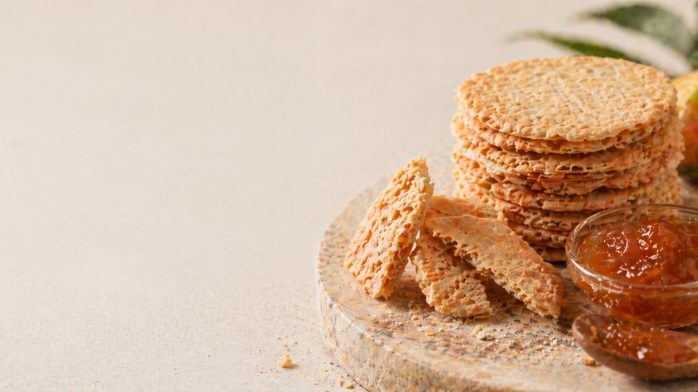

# BRIEF_VISUEL_HERO_PHASE1 — C-Kreyol

**Documents liés** : [SPEC_HERO_HOMEPAGE.md](SPEC_HERO_HOMEPAGE.md) (gel copy + direction visuelle), [CHARTE_GRAPHIQUE_PHASE1.md](CHARTE_GRAPHIQUE_PHASE1.md) (Direction A, photo §7, hero §9.1), [DESIGN.md](DESIGN.md), [WIREFRAME_HOMEPAGE.md](WIREFRAME_HOMEPAGE.md) (bloc 2), [DIRECTIONS_ARTISTIQUES_PHASE1.md](DIRECTIONS_ARTISTIQUES_PHASE1.md), [ARCHITECTURE_DECISION_RECORD.md](ARCHITECTURE_DECISION_RECORD.md) (**ADR-CKR-005** promesse / disponibilité).

---

## 1. Objet

Produire le ou les **visuels** du **hero homepage** de **C-Kreyol** en Phase 1, en cohérence avec :

- [SPEC_HERO_HOMEPAGE.md](SPEC_HERO_HOMEPAGE.md) ;
- [CHARTE_GRAPHIQUE_PHASE1.md](CHARTE_GRAPHIQUE_PHASE1.md) ;
- [DESIGN.md](DESIGN.md) ;
- [WIREFRAME_HOMEPAGE.md](WIREFRAME_HOMEPAGE.md).

Le visuel doit soutenir un hero qui fait comprendre **immédiatement** :

- qu’il s’agit de **produits agro transformés antillais** ;
- proposés via un **canal retail digital spécialisé** ;
- **sans** folklore visuel, **sans** imagerie touristique, **sans** sur-promesse ([ADR-CKR-005](ARCHITECTURE_DECISION_RECORD.md#adr-ckr-005)).

---

## 2. Références d’inspiration

### A. Caribshopper — inspiration retail visuelle

**À retenir** :

- logique **retail digital** ;
- sentiment de **sélection** ;
- hiérarchie de lecture **claire** ;
- capacité à faire exister une offre par **collections**, **origines** et **usages** ;
- perception de marque **contemporaine**.

**À ne pas copier** :

- la **largeur** de catalogue ;
- la **densité** de navigation ;
- l’effet « **grand agrégateur** ».

### B. La Maison des Antilles — inspiration crédibilité marché

**À retenir** :

- **sérieux** commercial ;
- lisibilité d’un **univers antillais** ;
- perception d’un **acteur installé** ;
- ancrage **produit réel**.

**À ne pas copier** :

- une logique de **profondeur catalogue massive** dès la homepage ;
- un **front trop chargé**.

---

## 3. Intention visuelle du hero

Le hero doit montrer **la matière** et la **transformation** plus que le simple **packaging**.

Le bon imaginaire est :

- **produit réel** ;
- **texture visible** ;
- **lumière naturelle** ;
- **composition sobre** ;
- **gourmandise maîtrisée** ;
- **retail sérieux**.

La direction retenue est prioritairement : **macro / gros plan matière** (cf. [SPEC_HERO_HOMEPAGE.md §7](SPEC_HERO_HOMEPAGE.md)).

---

## 4. Sujet visuel principal

**Univers produit** attendu :

- biscuits artisanaux à base de **farine de manioc** ;
- produits **secs** et **sucrés** ;
- crêpes de manioc fourrées à la **confiture** de fruits tropicaux ;
- **matière**, **cassure**, **texture**, **garniture**, **transformation**.

Le visuel ne doit **pas** faire reposer **toute** la lecture sur le **sachet fermé** ou sur l’**étiquette fournisseur** seule.

---

## 5. Ce qu’il faut montrer

**À privilégier** :

- détail de **texture biscuit** ;
- matière du **manioc transformé** ;
- confiture / fruit tropical en **rappel mesuré** si pertinent ;
- produit **sorti du sachet** ou présenté de manière plus **éditoriale** ;
- lumière **douce**, **naturelle** ;
- fond **simple**, **chaud**, cohérent avec la **charte Phase 1** ;
- **respiration visuelle** permettant l’intégration du **titre**, du **sous-texte** et du **CTA**.

### Deux pistes acceptables

#### Piste 1 — Macro matière *(prioritaire)*

- gros plan biscuit / manioc / confiture ;
- **cadrage serré** ;
- image **sensorielle** mais **sobre** ;
- peu d’éléments **parasites**.

#### Piste 2 — Plateau calme

- **2 à 4** produits maximum ;
- composition **stable** ;
- surfaces **bois** / **neutres** ;
- image toujours **centrée produit**, jamais **lifestyle** chargé.

---

## 6. Ce qu’il faut éviter

- **sachet produit seul** comme hero final, **sans** travail éditorial ;
- **branding fournisseur** trop dominant dans l’image ;
- **palmiers**, **plage**, carte postale, **tourisme** visuel ;
- folklore « créole » **caricatural** ;
- décor **surchargé** ;
- scène de vie trop **narrative** ;
- image **institutionnelle** (bureau, logistique, entrepôt, **Nantes**) ;
- **multiplication** d’éléments concurrents dans le cadre.

---

## 7. Hiérarchie de marque à respecter

Le hero doit servir **d’abord** :

1. **C-Kreyol** ;
2. l’**offre** ;
3. l’**origine lisible** des produits.

Il ne doit **pas** visuellement faire basculer le premier écran en :

- hero « **La Platine** » ;
- hero « **fabricant unique** » ;
- hero « **packshot fournisseur** ».

**La Platine** peut **nourrir** la matière visuelle, mais ne doit **pas absorber** la hiérarchie de marque du hero (cf. [SPEC_HERO_HOMEPAGE.md §4](SPEC_HERO_HOMEPAGE.md)).

---

## 8. Direction esthétique à respecter

**Référence charte** : **Direction A — Épicerie fine tropicale** ([CHARTE_GRAPHIQUE_PHASE1.md](CHARTE_GRAPHIQUE_PHASE1.md) §2 / §3).

**Mots-clés** : raffiné, organique, éditorial, chaleureux, sobre, non folklorique.

**Palette de référence** (indicative, détail [CHARTE_GRAPHIQUE_PHASE1.md §4](CHARTE_GRAPHIQUE_PHASE1.md)) :

- terracotta ;
- sage ;
- off-white chaud ;
- charcoal ;
- amber en **accent léger**.

---

## 9. Contraintes techniques

Prévoir un visuel **exploitable** :

- en **desktop** et **mobile** ;
- avec **zone respirante** pour superposer : titre, sous-texte, CTA ;
- avec bon niveau de **contraste** ;
- sans **poids** excessif ;
- avec **recadrages** possibles.

**Livrables souhaités** :

- **1** visuel principal hero **desktop** ;
- **1** déclinaison **mobile** ou cadrage **compatible mobile** ;
- si possible **1** variante de **secours**.

---

## 10. Références visuelles versionnées

### 10.1 Exemple produit (packaging — La Platine)

Le visuel du **sachet de crackers manioc La Platine** — fichier [assets/exemple_produit_manioc_crackers_la_platine.png](assets/exemple_produit_manioc_crackers_la_platine.png) (voir [SPEC_HERO_HOMEPAGE.md §3.4](SPEC_HERO_HOMEPAGE.md)) — peut servir :

- de **référence produit réelle** ;
- de base pour comprendre **matière** / **packaging** / **ton** ;
- éventuellement de point de départ pour un **crop** ou un **shooting dérivé**.

Il ne constitue **pas**, à lui seul, le **hero final idéal**. Le hero doit aller vers une image plus **éditoriale**, plus **matière**, moins **packshot**.

### 10.2 Moodboard hero — macro / matière (Direction A)

Visuel **versionné** dans le dépôt : [assets/hero_reference_direction_a_biscuits_confiture.png](assets/hero_reference_direction_a_biscuits_confiture.png).

**Lecture pour la production** :

- **Piste 1** (macro / matière) : texture biscuit **lisible**, confiture en **rappel mesuré**, **lumière douce** ;
- **Espace négatif** à gauche (en **desktop**) : zone pour **titre**, **sous-texte** et **CTA** — à **valider** en maquette avec le **copy gelé** [SPEC_HERO_HOMEPAGE.md §7](SPEC_HERO_HOMEPAGE.md) (pas de texte « inventé » sur l’image) ;
- **Fond** et **tons** : cohérents **off-white** / **amber** / pierre — proches de la [CHARTE_GRAPHIQUE_PHASE1.md §4](CHARTE_GRAPHIQUE_PHASE1.md) ;
- **Éléments** type feuille / fruit en arrière-plan : **discrets** ; vérifier qu’ils ne basculent **pas** vers le **tourisme** visuel (§6).

**Statut** : **référence de composition** pour shooting ou retouche — **pas** un engagement sur un produit **exact** du catalogue tant que les **fiches** ne le portent pas.

### 10.3 Banque photos homepage (packshots — La Platine)

Trois visuels **versionnés** pour la **homepage** (produits réels, **packshots** ; utiles pour **vignettes**, **blocs catalogue**, **sélection produits**, ou **base** avant crop plus éditorial — cf. §6 « sachet seul »).

| Fichier | Produit (d’après packaging) | Remarque |
|---------|----------------------------|----------|
| [homepage_maniocookies_sale_la_platine.png](assets/homepage_maniocookies_sale_la_platine.png) | **Maniocookies** (sachet, étiquette orange **La Platine**) | Packshot centré, fond clair. |
| [homepage_manioc_crackers_sale_ste_anne.png](assets/homepage_manioc_crackers_sale_ste_anne.png) | **Manioc crackers** salés, **97180 Sainte-Anne** (Guadeloupe) | Proche de l’[exemple sucré](assets/exemple_produit_manioc_crackers_la_platine.png) ; variante **salée**. |
| [homepage_manioc_pates_mayotte_la_platine.png](assets/homepage_manioc_pates_mayotte_la_platine.png) | **Manioc pâtes**, **Mayotte**, **La Platine** | Sous-vide, rendu plus **industriel** ; à utiliser avec **discernement** sur la homepage (pas comme **unique** visuel hero sans traitement). |

**Usage recommandé** :

- **Hero principal** : ne **pas** se limiter à ces **packshots** seuls ; combiner avec **§10.2** (moodboard) ou un **shooting** macro / matière.
- **Qualité** : vérifier **résolution** et **netteté** avant mise en ligne ; prévoir **reprise** ou **re-shoot** si besoin.

---

## 11. Résultat attendu

Le visiteur doit ressentir en **premier écran** :

- une offre **réelle** ;
- une sélection **soignée** ;
- une origine **lisible** ;
- une qualité **retail sérieuse** ;
- une envie d’**entrer dans la boutique**.

Le visuel doit donner **envie d’acheter**, **sans jamais mentir** sur le canal ni sur la **réalité** des produits.

---

## Historique du document

| Date | Changement |
|------|------------|
| 2026-04-21 | Création : brief **visuel hero** Phase 1 ; liens **SPEC**, **CHARTE**, **DESIGN**, **WIREFRAME**, **DIRECTIONS**, **ADR-005**. |
| 2026-04-21 | **§10** : scission **10.1** packaging / **10.2** moodboard hero ; fichier `docs/assets/hero_reference_direction_a_biscuits_confiture.png`. |
| 2026-04-21 | **§10.3** : **banque photos homepage** — 3 packshots La Platine (`homepage_maniocookies_…`, `homepage_manioc_crackers_…`, `homepage_manioc_pates_…`). |
