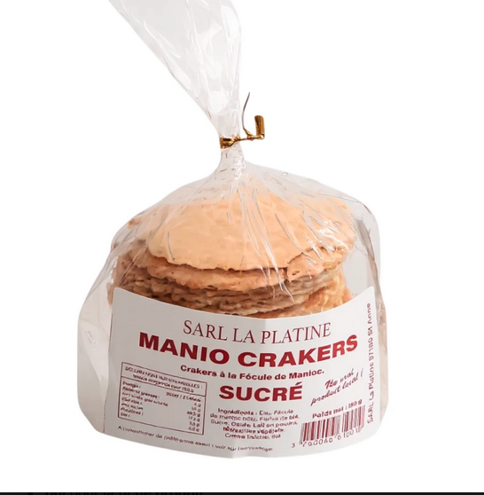

# SPEC_HERO_HOMEPAGE — C-Kreyol

Ce document **cadre le hero de la homepage** (Phase 1) : **message**, **ton**, **CTA** et **visuel**. Il complète [WIREFRAME_HOMEPAGE.md](WIREFRAME_HOMEPAGE.md) (**Bloc 2**), [DESIGN.md](DESIGN.md), [CHARTE_GRAPHIQUE_PHASE1.md](CHARTE_GRAPHIQUE_PHASE1.md), [DIRECTIONS_ARTISTIQUES_PHASE1.md](DIRECTIONS_ARTISTIQUES_PHASE1.md) (intentions **visuelles** indicatives), [BRIEF_VISUEL_HERO_PHASE1.md](BRIEF_VISUEL_HERO_PHASE1.md) (**production** des assets hero), [STRUCTURE_MENU_PRINCIPAL.md](STRUCTURE_MENU_PRINCIPAL.md) et les [ADR](ARCHITECTURE_DECISION_RECORD.md) pertinents (**ADR-CKR-003** présentation, **ADR-CKR-005** promesse / disponibilité).

Le hero est le **premier arbitrage narratif** de la page — **gelé** pour le **copy** et le **cadrage visuel** Phase 1 au **§7** (2026-04-21) ; l’**implémentation** (assets finaux, thème) suit.

---

## 1. Exigence doctrinale (rappel)

En **une lecture**, le visiteur doit comprendre :

- **quoi** : des **produits agro transformés antillais** ;
- **comment** : via un **canal retail digital spécialisé** porté par la marque **C-Kreyol** ;

sans qu’un **sous-texte** ou un **visuel** **seuls** suffisent à deviner l’offre (éviter le hero **uniquement** « ambiance marque »).

**Hiérarchie du message dans le hero (Phase 1, tranché)** : le hero parle **d’abord** de **l’offre** et de **l’origine lisible des produits** (île, région, territoire — **honnête**, compatible avec le **catalogue réel**, [ADR-CKR-005](ARCHITECTURE_DECISION_RECORD.md#adr-ckr-005)), et de **l’esprit** de proposition (cf. §5). Il ne porte **pas** la **mécanique opératoire** (hub, chaîne logistique, « qui opère ») ni l’**ancrage géographique du projet** (**Nantes**) : ces éléments relèvent de blocs **plus bas** sur la homepage, du **bloc confiance** ou de pages type **À propos** (cf. §4).

**Suite homepage / catalogue** : l’**origine** reste un **repère commercial visible** (fiches produit, cartes produit, collections ; à terme entrées **territoires / origines** si pertinent) — cohérent avec ce qui est annoncé **dès** le hero.

---

## 2. Rapport à la charte graphique

La **charte minimale Phase 1** est **gelée** (**Direction A — épicerie fine tropicale**, [CHARTE_GRAPHIQUE_PHASE1.md](CHARTE_GRAPHIQUE_PHASE1.md) **§3–§11**) : **ton**, **palette**, **typos** de référence, **CTA**, **photo**, **icono**, **interdits**. Les **états UI** détaillés restent **à décliner** en implémentation — sans bloquer le **gel du copy** et du **cadrage visuel** du hero.

**Séquence** : **charte gelée** → **figer le hero** (§3–§7, dont §4 **localisation / provenance**) → **implémentation** thème ([ADR-CKR-002](ARCHITECTURE_DECISION_RECORD.md#adr-ckr-002) / [ADR-CKR-003](ARCHITECTURE_DECISION_RECORD.md#adr-ckr-003)).

---

## 3. Les quatre arbitrages — **gel** (2026-04-21)

Les **propositions** ci-dessous restent en **archive** ; les champs **retenu** reflètent l’**arbitrage** documenté en **§7**.

### 3.1 Titre (proposition de valeur courte)

- **Méthode** (rappel) : raisonner par **familles** de hero avant de trancher — voir tableau d’options.
- **Contraintes** : **court**, **concret**, lisible sur **mobile** sans retour ligne abusif.
- **Règle** : le titre doit pouvoir être **compris seul** — sans **dépendre** du visuel ni du sous-texte pour identifier la **nature de l’offre** (renforce le §1).

**Propositions de travail** (Phase 1, **5 max.** — **archive**) :

| # | Famille | Titre (proposition) |
|---|---------|---------------------|
| 1 | **Offre claire** | **C-Kreyol — agro transformés des Antilles, en ligne** |
| 2 | **Origine / territoires** | **Des Antilles à votre table : agro transformés aux origines lisibles** |
| 3 | **Retail / sélection** | **C-Kreyol : une sélection d’agro transformés antillais** |
| 4 | **Cadeau / découverte** | **Agro transformés des Antilles : à table, à offrir** |
| 5 | **Conviction / qualité perçue** | **L’épicerie fine antillaise en ligne : agro transformés d’origine** |

**Titre retenu** : **C-Kreyol : une sélection d’agro transformés antillais** (option **#3** — équilibre **retail** / **sérieux** / **Direction A**).

**Titre de secours** (si retours atelier marque : besoin d’encore plus de **directivité**) : **C-Kreyol — agro transformés des Antilles, en ligne** (option **#1**).

**Micro-réserve** (évolution possible hors gel immédiat) : l’expression **« agro transformés »** est **exacte** côté cadrage / SEO interne, mais un peu **administrative** pour le grand public ; à moyen terme, tester des formulations plus **grand public** (ex. **produits transformés des Antilles**, ou **biscuits, douceurs et épicerie des Antilles** dans le titre) sans casser la **cohérence** avec la [NOTE_DE_CADRAGE.md](NOTE_DE_CADRAGE.md) / fiches produit.

### 3.2 Sous-texte (1 à 2 phrases)

- **Contraintes** : complète le titre sans **répéter** mécaniquement le menu ; **pas** de sur-promesse stock / délais ([ADR-CKR-005](ARCHITECTURE_DECISION_RECORD.md#adr-ckr-005)) ; rester **court** sur mobile ; formulations **A / B / C** ci-dessous = **pistes non retenues telles quelles** (trop défensif, jargon interne, etc.).

**Propositions** (Phase 1, **3 max.** — **archive**) :

| # | Sous-texte (proposition) |
|---|--------------------------|
| A | Une sélection d’**agro transformés des Antilles**, avec des **origines lisibles** sur chaque fiche. **Disponibilités et détails** : comme indiqué **en boutique** — sans promesse de délai ni de stock non garanti. |
| B | **C-Kreyol** rassemble des produits authentiques (biscuits, confiseries, épicerie) pour faire découvrir le goût des Antilles **sans folklore**. **Parcourez le catalogue** au fil des arrivages. |
| C | Le plaisir des saveurs antillaises, **choisi avec exigence retail**. **Entrez en boutique** pour composer votre panier selon les références **réellement proposées**. |

**Sous-texte retenu** : **Biscuits, douceurs et épicerie des Antilles, sélectionnés avec soin pour faire découvrir des origines et des saveurs authentiques.**  
*(Inspiré de la piste **B**, adoucie : pas de « sans folklore » ni « exigence retail » en hero ; la **rigueur disponibilité** peut vivre **plus bas** sur la page ou sur les **fiches**.)*

### 3.3 CTA principal

- **Comportement** : un **CTA principal** unique prioritaire ; CTA secondaires **discrètes** si besoin.
- **Règle** : le CTA principal oriente vers une action **immédiatement tenable** en Phase 1, **prioritairement** l’**exploration de la boutique** (éviter un libellé trop **conceptuel** ou une cible pas encore **opérationnelle**).
- **CTA secondaire** (implémentation actuelle) : **« Explorer le catalogue »** — ancre vers la section **Explorer** (`#explorer-catalogue`), cohérent avec [ADR-CKR-006](ARCHITECTURE_DECISION_RECORD.md#adr-ckr-006) et [WIREFRAME_HOMEPAGE.md](WIREFRAME_HOMEPAGE.md) Bloc 3 ; **discret** (bouton secondaire, sans `lg` sur le primaire).

**Propositions de libellé** (Phase 1, **2 max.** — **archive**) :

| # | Libellé CTA |
|---|-------------|
| 1 | **Découvrir la boutique** |
| 2 | **Voir les produits** |

**Libellé retenu** : **Découvrir la boutique** — cible **/shop** (ou équivalent menu **Boutique**, [STRUCTURE_MENU_PRINCIPAL.md](STRUCTURE_MENU_PRINCIPAL.md)).

### 3.4 Visuel

- **Contraintes** : **performance** (formats, poids) ; **cohérence** avec la promesse **honnête** (pas de mise en scène **déconnectée** du catalogue réel) ; alignement [CHARTE_GRAPHIQUE_PHASE1.md](CHARTE_GRAPHIQUE_PHASE1.md) **§7** (photo) et **§9.1** (hero).

**Propositions** (Phase 1, **2 max.** — **archive**) :

| # | Direction visuelle | Description |
|---|-------------------|-------------|
| 1 | **Macro / gros plan** *(recommandé avec la charte **Direction A**)* | Texture **réelle** (biscuit, manioc, confiture, pâte), **lumière naturelle**, fond sobre ; met la **matière** et la **transformation** au centre — **peu ou pas** de scène de vie. |
| 2 | **Plateau calme** | **2 à 4** produits disposés avec **lumière naturelle** et surfaces **bois / neutres** ; reste **centré produit**, sans scène **lifestyle** chargée. |

**À éviter pour ce hero en Phase 1** : photo d’**équipe** dominante, **lifestyle** trop narratif, visuel **institutionnel** (bureau, hub), illustration **décorative** sans lien direct avec le catalogue.

**Direction visuelle retenue** : **Piste 1 — macro / gros plan** sur **matière réelle** (biscuit, manioc, confiture, texture), **lumière naturelle**, composition **sobre** — avec **recadrage** ou **shooting dérivé** si l’image d’**exemple produit** (paragraphe suivant) met trop en avant le **packaging fabricant** au détriment de **C-Kreyol** (cf. **§4**).

#### Référence « exemple de produit » (La Platine — manioc)

Visuel **versionné** dans le dépôt (cadrage type **piste 1** / **piste 2** : produit réel, fond clair, packaging lisible) :

- **Intérêt** : **matière** visible (disques, texture), **origine** lisible sur l’étiquette (ex. **97180 Sainte-Anne**), rendu **sobre** et **e-commerce** — aligné [CHARTE_GRAPHIQUE_PHASE1.md](CHARTE_GRAPHIQUE_PHASE1.md) **§7**.
- **Attention hero** (cf. **§4** ci-dessous) : le packaging porte la marque **fabricant** ; pour le **hero C-Kreyol**, prévoir un **recadrage** ou une **photo déclinée** pour que le **premier message** reste **l’offre canal** + **produit**, sans que **La Platine** **absorbe** la hiérarchie visuelle (détails en **bloc fournisseur** wireframe).

#### Référence composition (moodboard — Direction A)

Visuel **versionné** pour la **piste macro / matière** (sans packaging dominant) :

- **Rôle** : **moodboard** aligné [BRIEF_VISUEL_HERO_PHASE1.md §10.2](BRIEF_VISUEL_HERO_PHASE1.md) ; utile pour **brief** photographe / retouche et **tests** titre + CTA sur **espace négatif**.
- **Copy** : utiliser **uniquement** le texte **gelé** au **§7** (pas de titres alternatifs posés sur l’image seule).

#### Banque photos homepage (packshots)

Visuels **versionnés** pour la **homepage** (sélection produits, vignettes, etc.) — détail et usages : [BRIEF_VISUEL_HERO_PHASE1.md §10.3](BRIEF_VISUEL_HERO_PHASE1.md).

| Aperçu | Fichier |
|--------|---------|
| Maniocookies salés La Platine | `docs/assets/homepage_maniocookies_sale_la_platine.png` |
| Manioc crackers salés Ste-Anne | `docs/assets/homepage_manioc_crackers_sale_ste_anne.png` |
| Manioc pâtes Mayotte | `docs/assets/homepage_manioc_pates_mayotte_la_platine.png` |

Pour le **hero principal**, rester aligné sur la **direction visuelle gelée** §7 (macro / matière + **§10.2** brief) ; ces **packshots** complètent surtout les **autres blocs** de la homepage.

---

## 4. Localisation, provenance et hiérarchie (tranchés Phase 1)

- **Nantes** n’est **pas** mis en avant dans le **hero** en Phase 1 ; cette information relève plutôt du **bloc d’ancrage / de confiance**, d’éléments **plus bas** sur la homepage ou de la page **À propos** — éviter de **brouiller** le premier écran avec du « cadre projet ».
- **La Platine** : **plutôt hors** du **hero principal** ; mise en avant **fournisseur** conforme au [WIREFRAME_HOMEPAGE.md](WIREFRAME_HOMEPAGE.md) **bloc 4** (et au-delà), sans **absorber** la marque **C-Kreyol**.
- L’**origine des produits** (île, région, territoire) constitue en revanche un **élément légitime** de la **promesse visible dès le hero**, dès lors qu’elle reste **lisible**, **honnête** et **compatible** avec l’offre **réellement disponible** ([ADR-CKR-005](ARCHITECTURE_DECISION_RECORD.md#adr-ckr-005)).

---

## 5. Ton éditorial (indicatif)

**Direction** : **sérieux** et **chaleureux**, **accessible**, **sans** cliché exotique cheap (cf. [DESIGN.md §14](DESIGN.md)).

**À valider** : tutoiement / vouvoiement, niveau de **technicité** (ingrédients, terroir) dans le hero vs dans le corps de page.

---

## 6. Éléments à éviter

- titre **trop abstrait** ou purement **évocatif** (sans ancrage offre) ;
- sous-texte **trop long** ;
- visuel **décoratif** sans lien **lisible** avec l’offre ;
- **accumulation** dans le premier écran de la marque, des **origines**, de **Nantes**, de **La Platine** et de la **logistique** ;
- **promesse** de disponibilité ou de **délai** non soutenue par la **réalité opérationnelle** ([ADR-CKR-005](ARCHITECTURE_DECISION_RECORD.md#adr-ckr-005)).

---

## 7. Décision cible — **hero Phase 1 gelé** (2026-04-21)

**Choix déjà cadrés** (cf. §4) : **Nantes** et **La Platine** **hors** message principal du hero ; **origine produit** **oui** dans le hero si formulation sobre et alignée stock.

**Arbitrage contenu hero** (aligné [CHARTE_GRAPHIQUE_PHASE1.md](CHARTE_GRAPHIQUE_PHASE1.md) **Direction A**, [DIRECTIONS_ARTISTIQUES_PHASE1.md](DIRECTIONS_ARTISTIQUES_PHASE1.md) reco **A**) :

| Élément | Décision retenue |
|---------|------------------|
| **Titre** | **C-Kreyol : une sélection d’agro transformés antillais** (option tableau **#3** ; **secours** : **#1** — §3.1). |
| **Sous-texte** | **Biscuits, douceurs et épicerie des Antilles, sélectionnés avec soin pour faire découvrir des origines et des saveurs authentiques.** |
| **CTA principal** | **Découvrir la boutique** → **/shop** (menu **Boutique**). |
| **Direction visuelle** | **Macro / gros plan** — matière réelle, lumière naturelle, sobre (§3.4 **piste 1**) ; **exemple packaging** `docs/assets/exemple_produit_manioc_crackers_la_platine.png` ; **référence composition** (moodboard Direction A) `docs/assets/hero_reference_direction_a_biscuits_confiture.png` — voir [BRIEF_VISUEL_HERO_PHASE1.md §10.2](BRIEF_VISUEL_HERO_PHASE1.md) ; **crop** ou **déclinaison photo** si besoin pour **§4** (La Platine). |

### Affinage éditorial ultérieur (sans remise en cause du gel)

Le **wording exact** du hero (**titre** et **sous-texte** tels qu’ils figurent au **§3** / tableau **§7**) pourra être **raffiné** en **atelier éditorial** plus tard (rythme, synonymes, longueur mobile, SEO), **sans** remettre en cause les **décisions déjà gelées** sur :

- la **hiérarchie** du message (§1) ;
- la **place** de l’**origine** produit (§4) ;
- l’**exclusion** de **Nantes** et de **La Platine** du **message principal** du hero (§4) ;
- le **CTA principal** orienté **boutique** (§3.3 / §7) ;
- la **direction visuelle** **macro / matière** (§3.4 / §7).

Tout affinage doit **rester compatible** avec ces **invariants** et avec [ADR-CKR-005](ARCHITECTURE_DECISION_RECORD.md#adr-ckr-005).

**À poursuivre** : **responsable validation marque** ([CHARTE_GRAPHIQUE_PHASE1.md](CHARTE_GRAPHIQUE_PHASE1.md) §11) ; **assets finaux** (shooting / export web) selon [BRIEF_VISUEL_HERO_PHASE1.md](BRIEF_VISUEL_HERO_PHASE1.md) ; **états UI** en implémentation ; **tests mobile** sur la composition réelle du bloc hero.

---

## Historique du document

| Date | Changement |
|------|------------|
| 2026-04-21 | Création : exigence §1, quatre arbitrages (titre, sous-texte, CTA, visuel), questions Nantes / La Platine, ton, décision **[à compléter]** ; liens wireframe, design, ADR. |
| 2026-04-21 | **§2** : séquence **charte minimale** avant gel hero ; lien **[CHARTE_GRAPHIQUE_PHASE1.md](CHARTE_GRAPHIQUE_PHASE1.md)** ; renumérotation §3–§6 (évolué §3–§7). |
| 2026-04-21 | **§2** : liste des prérequis charte alignée sur **CHARTE** §2 enrichi (ton visuel, états UI, iconographie) — **évolué** : voir **CHARTE** **§3** (tableau figé). |
| 2026-04-21 | **§7** : renvoi **CHARTE** **§3–§9** + responsable §11 ; charte **Direction A** gelée. |
| 2026-04-21 | **§1** : hiérarchie message hero (offre + origine ; pas mécanique opératoire / Nantes). **§4** : Nantes / La Platine / **origine** **tranchés** ; **§5** ex-§4 Ton ; **§6** décision cible clarifiée (devenu **§7**). |
| 2026-04-21 | Ouverture **cadre** ; **§3.1** / **§3.3** règles titre / CTA ; **§6** **Éléments à éviter** ; **§7** décision cible (ex-§6). |
| 2026-04-21 | **§3.1** : méthode **familles** ; **5 propositions** de titre (tableau) ; **§7** : enchaînement titre → 2 sous-textes → CTA → visuel. |
| 2026-04-21 | Intro : lien **[DIRECTIONS_ARTISTIQUES_PHASE1.md](DIRECTIONS_ARTISTIQUES_PHASE1.md)** (intentions visuelles). |
| 2026-04-21 | **§2** : charte **gelée** ; **§3.2–§3.4** : **3** sous-textes, **2** CTA, **2** directions visuelles + **reco** macro / texture ; shortlist titres **#1/#3** ; intro **ADR-CKR-003** ; **§7** consolidation gel hero. |
| 2026-04-21 | **§3.4** : **exemple produit** versionné `docs/assets/exemple_produit_manioc_crackers_la_platine.png` + règles **crop** / hiérarchie vs **§4**. |
| 2026-04-21 | **Gel hero** : **§3** restructuré (**archive** + **retenu**) ; **titre #3**, **sous-texte** adouci (piste B), **CTA** « Découvrir la boutique », **visuel piste 1** ; **§7** tableau décision ; **titre secours #1** ; **micro-réserve** « agro transformés ». |
| 2026-04-21 | **§7** : clause **affinage éditorial** ultérieur **sans** remise en cause hiérarchie, **origine**, **Nantes** / **La Platine**, **CTA boutique**, **visuel macro**. |
| 2026-04-21 | Intro + **§7** : lien **[BRIEF_VISUEL_HERO_PHASE1.md](BRIEF_VISUEL_HERO_PHASE1.md)** (production assets hero). |
| 2026-04-21 | **§3.4** + **§7** : asset `hero_reference_direction_a_biscuits_confiture.png` (moodboard) ; lien **BRIEF** §10.2. |
| 2026-04-21 | **§3.4** : **banque photos homepage** (3 packshots) ; **BRIEF** §10.3. |
